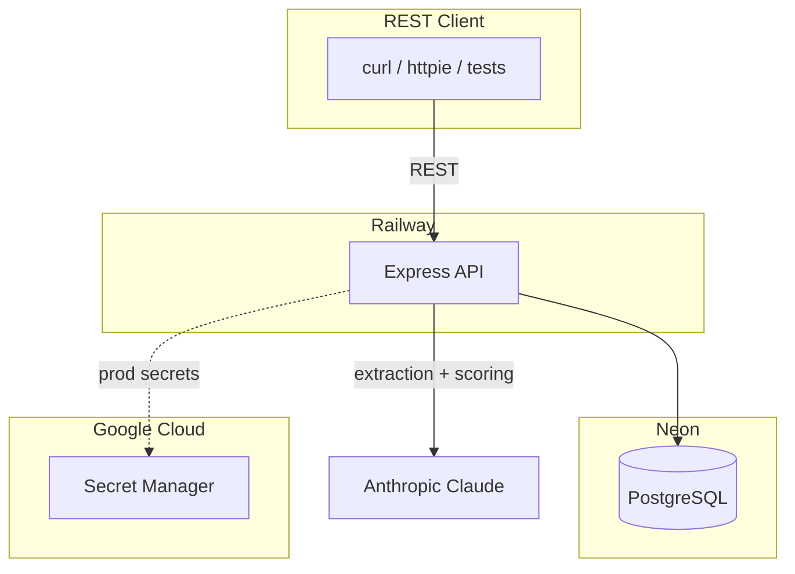
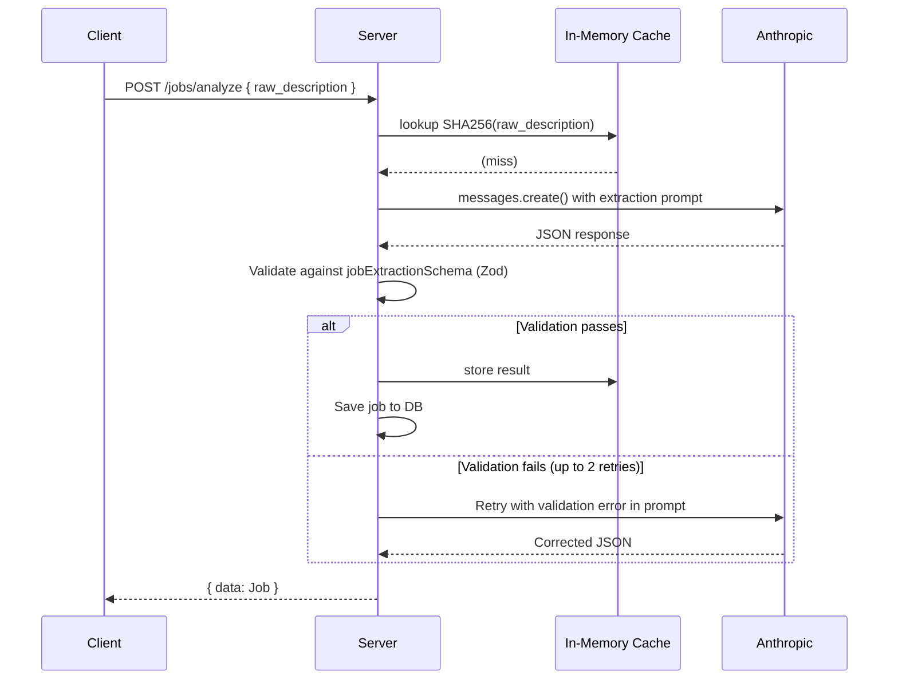
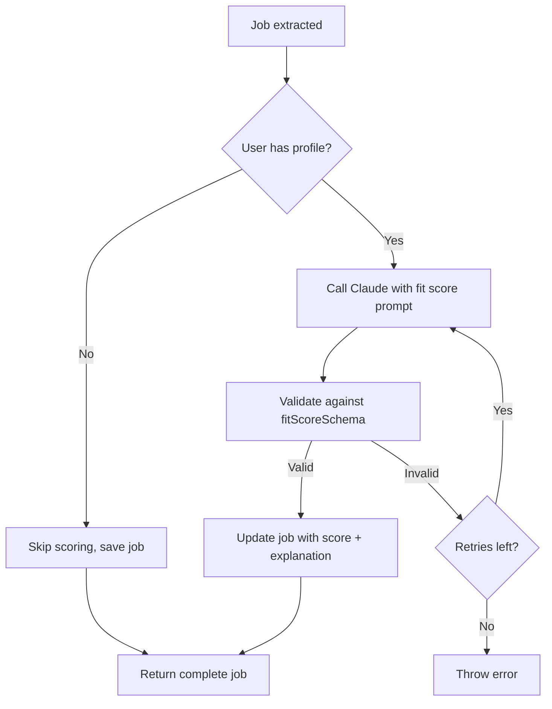
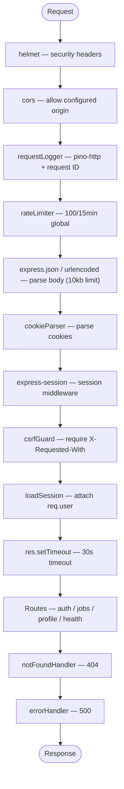

# Job Tracker AI — Technical Overview

## Table of Contents

1. [Project Context](#1-project-context)
2. [Architecture Overview](#2-architecture-overview)
3. [Tech Stack](#3-tech-stack)
4. [Package Inventory](#4-package-inventory)
5. [Repository Structure](#5-repository-structure)
6. [Database Schema](#6-database-schema)
7. [API Reference](#7-api-reference)
8. [System Design Deep Dives](#8-system-design-deep-dives)
   - [AI Structured Extraction](#81-ai-structured-extraction)
   - [Fit Scoring](#82-fit-scoring)
   - [Authentication](#83-authentication)
9. [Middleware Stack](#9-middleware-stack)
10. [Deployment](#10-deployment)
11. [Architectural Decisions](#11-architectural-decisions)

---

## 1. Project Context

This is App 1 in a portfolio of eight progressive full-stack AI applications. Its primary purpose is to demonstrate **structured extraction with Zod schema validation** — prompting an LLM to return JSON, validating the response against a strict schema, and retrying with error context on failure. This pattern is reused across later apps in the portfolio.

The application is an API-only job tracker — no frontend. All interactions happen via REST endpoints, tested with Vitest + Supertest and manual API calls.

---

## 2. Architecture Overview



**Deployment targets:**

- API server → Railway (Docker container)
- Database → Neon (serverless PostgreSQL)
- Secrets → Google Cloud Secret Manager (production only)

---

## 3. Tech Stack

| Layer               | Technology       | Version                  | Notes                                        |
| ------------------- | ---------------- | ------------------------ | -------------------------------------------- |
| **API server**      | Express          | 5.x                      | Async error propagation built-in             |
| **Language**        | TypeScript       | 5.x                      | Strict mode                                  |
| **Runtime**         | Node.js          | ≥ 22.0                   | Required for ES module support               |
| **Database**        | PostgreSQL       | 13+                      | Hosted on Neon (serverless)                  |
| **LLM**             | Anthropic Claude | claude-sonnet-4-20250514 | Structured extraction + scoring              |
| **Auth**            | Custom sessions  | —                        | bcrypt + express-session + connect-pg-simple |
| **Logging**         | Pino             | 10.x                     | JSON in prod, pino-pretty in dev             |
| **Validation**      | Zod              | 4.x                      | Schemas for all inputs + LLM outputs         |
| **Testing**         | Vitest           | 3.x                      | Unit + integration, supertest                |
| **Package manager** | npm              | —                        | Single-package repo (no monorepo)            |

---

## 4. Package Inventory

### Runtime Dependencies

| Package                        | Purpose                                                             |
| ------------------------------ | ------------------------------------------------------------------- |
| `@anthropic-ai/sdk`            | Claude API calls for extraction and fit scoring                     |
| `@google-cloud/secret-manager` | Fetches secrets from GCP Secret Manager in production               |
| `bcrypt`                       | Password hashing with 12 salt rounds                                |
| `connect-pg-simple`            | Stores express-session sessions in PostgreSQL                       |
| `cookie-parser`                | Parses HTTP cookies into `req.cookies`                              |
| `cors`                         | Cross-origin resource sharing middleware                            |
| `dotenv`                       | Loads `.env` file into `process.env`                                |
| `express`                      | HTTP framework (v5 — async errors propagated automatically)         |
| `express-rate-limit`           | In-memory rate limiting; global + auth-specific                     |
| `express-session`              | Session middleware backed by connect-pg-simple                      |
| `helmet`                       | Sets security headers (XSS, clickjacking, MIME sniffing protection) |
| `node-pg-migrate`              | Database migrations in JavaScript                                   |
| `pg`                           | PostgreSQL client and connection pool                               |
| `pino`                         | Structured JSON logger                                              |
| `pino-http`                    | HTTP request/response logging middleware                            |
| `zod`                          | Runtime schema validation for all request bodies and LLM outputs    |

### Dev Dependencies

| Package                  | Purpose                                            |
| ------------------------ | -------------------------------------------------- |
| `tsx`                    | TypeScript execution for development (`tsx watch`) |
| `tsc-alias`              | Resolves path aliases after `tsc` compilation      |
| `vitest`                 | Test runner                                        |
| `supertest`              | HTTP assertion library for integration tests       |
| `pino-pretty`            | Human-readable log formatting in development       |
| `eslint-plugin-security` | Security-focused ESLint rules                      |
| `lefthook`               | Git hook runner (pre-commit lint + format check)   |

---

## 5. Repository Structure

This is a single-package project (not a monorepo). No frontend, no worker.

```
job-tracker-ai/
├── package.json
├── tsconfig.json                   # paths: { "app/*": ["src/*"] }
├── railway.json                    # Railway deploy config
├── lefthook.yml                    # Pre-commit hooks
├── migrations/
│   ├── ..._create-users-table.js
│   ├── ..._create-sessions-table.js
│   ├── ..._create_jobs_table.js
│   └── ..._create_resume_profiles_table.js
├── docs/
│   ├── FULL_APPLICATION_SPEC.md
│   ├── SUMMARY.md
│   └── TECHNICAL_OVERVIEW.md
└── src/
    ├── index.ts                    # Entry point: load secrets → load .env → startServer()
    ├── app.ts                      # Express app: middleware stack, route mounting
    ├── config/
    │   ├── env.ts                  # isProduction() helper
    │   ├── secrets.ts              # GCP Secret Manager integration (prod only)
    │   └── corsConfig.ts           # CORS origin, methods, headers
    ├── constants/
    │   └── session.ts              # SESSION_COOKIE_NAME = 'sid', SESSION_TTL_MS = 7d
    ├── db/
    │   └── pool/
    │       └── pool.ts             # pg.Pool config, query() wrapper, withTransaction()
    ├── handlers/
    │   ├── auth/
    │   │   └── auth.ts             # register, login, logout, me
    │   ├── jobs/
    │   │   ├── jobs.ts             # CRUD handlers (create, list, getById, update, remove)
    │   │   └── analyze.ts          # AI extraction + fit scoring handler
    │   └── profile/
    │       └── profile.ts          # getProfile, updateProfile (upsert)
    ├── middleware/
    │   ├── csrfGuard/              # Requires X-Requested-With on state-changing requests
    │   ├── errorHandler/           # Centralized 500 response; stack trace in dev only
    │   ├── notFoundHandler/        # 404 JSON response
    │   ├── rateLimiter/            # Global (100/15min) + auth-specific (10/15min)
    │   ├── requestLogger/          # pino-http with request ID generation
    │   └── requireAuth/            # loadSession (all routes), requireAuth (protected routes)
    ├── prompts/
    │   ├── extract-job.ts          # EXTRACTION_SYSTEM_PROMPT + buildExtractionPrompt()
    │   └── score-fit.ts            # FIT_SCORE_SYSTEM_PROMPT + buildFitScorePrompt()
    ├── repositories/
    │   ├── auth/
    │   │   └── auth.ts             # createUser, findUserByEmail, session management
    │   ├── jobs/
    │   │   └── jobs.ts             # Job CRUD + list with pagination
    │   └── profile/
    │       └── profile.ts          # getProfile, upsertProfile
    ├── routes/
    │   ├── auth.ts                 # Auth endpoint definitions with rate limiter
    │   ├── jobs.ts                 # Jobs + analyze endpoint definitions
    │   └── profile.ts              # Profile endpoint definitions
    ├── schemas/
    │   ├── auth.ts                 # registerSchema, loginSchema
    │   ├── job.ts                  # jobSchema, createJobSchema, updateJobSchema
    │   ├── job-extraction.ts       # jobExtractionSchema, fitScoreSchema (LLM output)
    │   └── profile.ts              # profileSchema, updateProfileSchema
    ├── services/
    │   ├── anthropic.service.ts    # Claude API wrapper (singleton client, lazy init)
    │   └── analyzer.service.ts     # extractJobDescription(), scoreFit(), analyzeAndSaveJob()
    ├── types/
    │   └── express.d.ts            # Extends Request with `user?: User`
    └── utils/
        ├── logs/
        │   └── logger.ts           # Pino instance (pino-pretty in dev, JSON in prod)
        └── parsers/
            ├── parseIdParam.ts     # UUID validation + parsing
            └── parsePagination.ts  # Limit/offset parser (1-100, default 50)
```

---

## 6. Database Schema

The database has four tables. All primary keys are UUIDs generated by PostgreSQL. Foreign keys use `ON DELETE CASCADE` throughout. An `updated_at` trigger fires on every UPDATE.

### `users`

```sql
CREATE TABLE users (
  id            UUID        PRIMARY KEY DEFAULT gen_random_uuid(),
  email         TEXT        NOT NULL UNIQUE,
  password_hash TEXT        NOT NULL,
  created_at    TIMESTAMPTZ DEFAULT NOW(),
  updated_at    TIMESTAMPTZ DEFAULT NOW()
);
-- Trigger: set_updated_at() fires on every UPDATE
```

### `session` (connect-pg-simple)

```sql
CREATE TABLE session (
  sid    VARCHAR PRIMARY KEY,
  sess   JSON    NOT NULL,
  expire TIMESTAMP NOT NULL
);
CREATE INDEX ON session (expire);
```

Managed by `connect-pg-simple` — stores express-session data in PostgreSQL. Expired sessions are cleaned up automatically.

### `jobs`

```sql
CREATE TABLE jobs (
  id              UUID        PRIMARY KEY DEFAULT gen_random_uuid(),
  user_id         UUID        NOT NULL REFERENCES users(id) ON DELETE CASCADE,
  title           TEXT,
  company         TEXT,
  location        TEXT,
  requirements    TEXT[]      DEFAULT '{}',
  tech_stack      TEXT[]      DEFAULT '{}',
  salary_range    TEXT,
  fit_score       INTEGER,                    -- 0-100, NULL if no profile
  fit_explanation TEXT,                        -- 1-3 sentence explanation
  status          TEXT        DEFAULT 'saved', -- saved | applied | interviewing | offer | rejected
  raw_description TEXT,                        -- original pasted text
  source          TEXT,                        -- 'ai-analyzed' or NULL (manual)
  created_at      TIMESTAMPTZ DEFAULT NOW(),
  updated_at      TIMESTAMPTZ DEFAULT NOW()
);
CREATE INDEX ON jobs (user_id);
CREATE INDEX ON jobs (created_at);
-- Trigger: set_updated_at() fires on every UPDATE
```

### `resume_profiles`

```sql
CREATE TABLE resume_profiles (
  id                  UUID        PRIMARY KEY DEFAULT gen_random_uuid(),
  user_id             UUID        NOT NULL UNIQUE REFERENCES users(id) ON DELETE CASCADE,
  skills              TEXT[]      DEFAULT '{}',
  experience_summary  TEXT,
  education           TEXT,
  job_title           TEXT,
  years_of_experience INTEGER,
  created_at          TIMESTAMPTZ DEFAULT NOW(),
  updated_at          TIMESTAMPTZ DEFAULT NOW()
);
-- One profile per user (UNIQUE on user_id)
-- Trigger: set_updated_at() fires on every UPDATE
```

---

## 7. API Reference

All routes require `Content-Type: application/json`. State-changing requests require `X-Requested-With: XMLHttpRequest` for CSRF protection. Authentication uses an HTTP-only session cookie (`sid`).

### Authentication

| Method | Path             | Auth | Description                                                              |
| ------ | ---------------- | ---- | ------------------------------------------------------------------------ |
| POST   | `/auth/register` | No   | Creates user + session. Body: `{ email, password }`. Returns `{ user }`. |
| POST   | `/auth/login`    | No   | Validates credentials, creates session. Returns `{ user }`.              |
| POST   | `/auth/logout`   | No   | Destroys session, clears cookie. Returns 204.                            |
| GET    | `/auth/me`       | Yes  | Returns `{ user }` for current session.                                  |

Auth routes are rate-limited at 10 requests per 15 minutes in production.

### Jobs

| Method | Path        | Auth | Description                                                                                                          |
| ------ | ----------- | ---- | -------------------------------------------------------------------------------------------------------------------- |
| POST   | `/jobs`     | Yes  | Creates a job manually. Body: `{ title?, company?, location?, requirements?, tech_stack?, salary_range?, status? }`. |
| GET    | `/jobs`     | Yes  | Lists all user's jobs with pagination. Query: `?limit=50&offset=0`. Returns `{ data, meta }`.                        |
| GET    | `/jobs/:id` | Yes  | Returns a single job.                                                                                                |
| PUT    | `/jobs/:id` | Yes  | Updates job fields.                                                                                                  |
| DELETE | `/jobs/:id` | Yes  | Deletes a job. Returns 204.                                                                                          |

### AI Analysis

| Method | Path            | Auth | Description                                                                                                                                     |
| ------ | --------------- | ---- | ----------------------------------------------------------------------------------------------------------------------------------------------- |
| POST   | `/jobs/analyze` | Yes  | Extracts structured data from raw text using Claude. Body: `{ raw_description }` (min 20 chars). Returns extracted job with optional fit score. |

### Resume Profile

| Method | Path       | Auth | Description                                                                                                                             |
| ------ | ---------- | ---- | --------------------------------------------------------------------------------------------------------------------------------------- |
| GET    | `/profile` | Yes  | Returns the user's resume profile. 404 if not created.                                                                                  |
| PUT    | `/profile` | Yes  | Creates or updates (upsert) the resume profile. Body: `{ skills?, experience_summary?, education?, job_title?, years_of_experience? }`. |

### Health

| Method | Path            | Auth | Description                                                     |
| ------ | --------------- | ---- | --------------------------------------------------------------- |
| GET    | `/health`       | No   | Returns `{ status: "ok" }`.                                     |
| GET    | `/health/ready` | No   | Queries DB; returns `{ status: "ok", db: "connected" }` or 503. |

---

## 8. System Design Deep Dives

### 8.1 AI Structured Extraction

The core AI pattern: prompt Claude to return JSON, validate with Zod, retry with error context on failure.

**End-to-end flow:**



**Extraction prompt design:**

The system prompt instructs Claude to return only valid JSON with no surrounding text. The user prompt includes:

- Field definitions (title, company, location, requirements, tech_stack, salary_range)
- Two few-shot examples showing expected JSON output
- The raw job description wrapped in `<job_description>` tags
- On retry: the Zod validation error, prefixed with `"IMPORTANT: Your previous response failed validation with:"`

**Zod validation schemas:**

```typescript
// LLM extraction output
const jobExtractionSchema = z.object({
  title: z.string().nullable(),
  company: z.string().nullable(),
  location: z.string().nullable(),
  requirements: z.array(z.string()),
  tech_stack: z.array(z.string()),
  salary_range: z.string().nullable(),
});

// LLM fit score output
const fitScoreSchema = z.object({
  score: z.number().int().min(0).max(100),
  explanation: z.string(),
});
```

**Response parsing:**

The service strips markdown code fences (` ```json ... ``` `) from Claude's response before JSON parsing. This handles cases where Claude wraps its output despite being told not to.

---

### 8.2 Fit Scoring

A second Claude call after extraction compares the job against the user's resume profile.



**Scoring guidance in prompt:**

- 80–100: Strong fit — most requirements met, relevant tech stack
- 60–79: Decent fit — many requirements met
- 40–59: Partial fit — some overlap
- Below 40: Weak fit — significant gaps

The prompt includes the candidate's job title, years of experience, skills array, and experience summary alongside the extracted job requirements and tech stack.

---

### 8.3 Authentication

Custom session-based authentication backed by PostgreSQL via `connect-pg-simple`.

**Registration flow:**

1. Validate email (format) and password (8–72 characters) with Zod
2. Hash password with bcrypt (12 salt rounds)
3. Insert user (email lowercased and trimmed)
4. Regenerate session (prevents session fixation)
5. Set `req.session.userId`
6. Return user object (201)

**Session details:**

| Property           | Value                            |
| ------------------ | -------------------------------- |
| Cookie name        | `sid`                            |
| TTL                | 7 days (604,800,000 ms)          |
| HttpOnly           | true                             |
| Secure             | true in production               |
| SameSite           | lax                              |
| Store              | PostgreSQL via connect-pg-simple |
| Resave             | false                            |
| Save uninitialized | false                            |

**Middleware:**

- `loadSession` — Runs on every request. Reads `req.session.userId`, fetches user from DB, attaches to `req.user`. Fails silently if session is invalid.
- `requireAuth` — Returns 401 if `req.user` is not set.

---

## 9. Middleware Stack

Middleware is applied in this order for every request:



**CSRF protection:**

Uses the `X-Requested-With` header check on POST, PUT, PATCH, and DELETE requests. Browsers cannot set custom headers in cross-site submissions without a CORS preflight, and CORS is locked to the configured origin. GET requests bypass this check.

---

## 10. Deployment

### Server (Railway)

Deployed directly from the repository to Railway. The `railway.json` configures health checks and restart policy.

```json
{
  "$schema": "https://railway.com/railway.schema.json",
  "build": { "builder": "NIXPACKS" },
  "deploy": {
    "startCommand": "node dist/index.js",
    "healthcheckPath": "/health",
    "healthcheckTimeout": 30,
    "restartPolicyType": "ON_FAILURE",
    "restartPolicyMaxRetries": 3
  }
}
```

Railway runs `npm run build` (tsc + tsc-alias) during the build step, then starts with `node dist/index.js`.

### Environment Variables

| Variable                           | Required   | Description                                    |
| ---------------------------------- | ---------- | ---------------------------------------------- |
| `DATABASE_URL`                     | Yes        | PostgreSQL connection string (Neon pooler URL) |
| `ANTHROPIC_API_KEY`                | Yes        | Claude API key                                 |
| `SESSION_SECRET`                   | Yes        | Secret for signing session cookies             |
| `CORS_ORIGIN`                      | Yes (prod) | Allowed origin for CORS                        |
| `NODE_ENV`                         | No         | Set to `production` on Railway                 |
| `PORT`                             | No         | HTTP port (default: 3000)                      |
| `GCP_PROJECT_ID`                   | No         | GCP project for Secret Manager                 |
| `GCP_SA_JSON`                      | No         | GCP service account credentials JSON           |
| `DATABASE_SSL_REJECT_UNAUTHORIZED` | No         | SSL verification (default: true in prod)       |

### Secret Management

In production, `ANTHROPIC_API_KEY` and `SESSION_SECRET` can be fetched from Google Cloud Secret Manager at server startup (via `loadSecrets()` in `index.ts`). If `GCP_SA_JSON` is not set, the server falls back to reading directly from environment variables.

---

## 11. Architectural Decisions

### API-Only (No Frontend)

This is intentionally backend-only. The goal is to learn Express patterns, PostgreSQL schema design, session auth, and LLM structured extraction without frontend complexity. The frontend pattern is introduced in App 2 (Link Saver AI).

### Express 5 over Express 4

Express 5 automatically catches errors thrown in async route handlers and passes them to the error-handling middleware. This eliminates try/catch in every handler — all handlers throw normally and rely on the centralized `errorHandler`.

### Layered Architecture (Routes → Handlers → Services → Repositories)

Each layer has a single responsibility:

- **Routes** — Define URL patterns, apply middleware (rate limiters, auth guards), connect to handlers
- **Handlers** — Parse/validate input, orchestrate calls, format HTTP responses
- **Services** — Business logic with no HTTP concerns (Claude API calls, extraction logic)
- **Repositories** — All SQL queries; return typed domain objects

### Zod for LLM Output Validation

The same library that validates user input also validates LLM output. This ensures type safety end-to-end: the extraction schema guarantees the AI response matches the expected shape before it touches the database. When validation fails, the error message is fed back into the next prompt — teaching the model to self-correct.

### In-Memory Extraction Cache

Analysis results are cached by SHA256 hash of the raw description text in a `Map`. This prevents re-analyzing identical job descriptions within the same server lifetime. The cache doesn't survive restarts, which is acceptable for a single-server deployment — a persistent cache (Redis) is introduced in App 2.

### Retry with Error Context

When Zod validation fails, the extraction is retried up to 2 additional times. Each retry includes the validation error in the prompt:

```
IMPORTANT: Your previous response failed validation with: {zodError}
```

This gives Claude specific feedback on what went wrong (missing fields, wrong types, etc.) and dramatically improves retry success rates compared to blind retries.

### connect-pg-simple over Custom Session Store

Using `connect-pg-simple` for session storage leverages the existing PostgreSQL database — no additional infrastructure. Sessions survive server restarts and can be managed with standard SQL queries. This is simpler than the custom SHA256-hashed session tokens used in App 2.

### Parameterized Queries Throughout

All SQL uses `$1, $2` placeholders via node-postgres. No string concatenation for SQL construction, eliminating SQL injection as an attack vector.

### Trigger-Based Timestamps

A PostgreSQL function `set_updated_at()` is created once and reused across all tables. It automatically sets `updated_at = NOW()` on every UPDATE, so application code never needs to manage this field.
